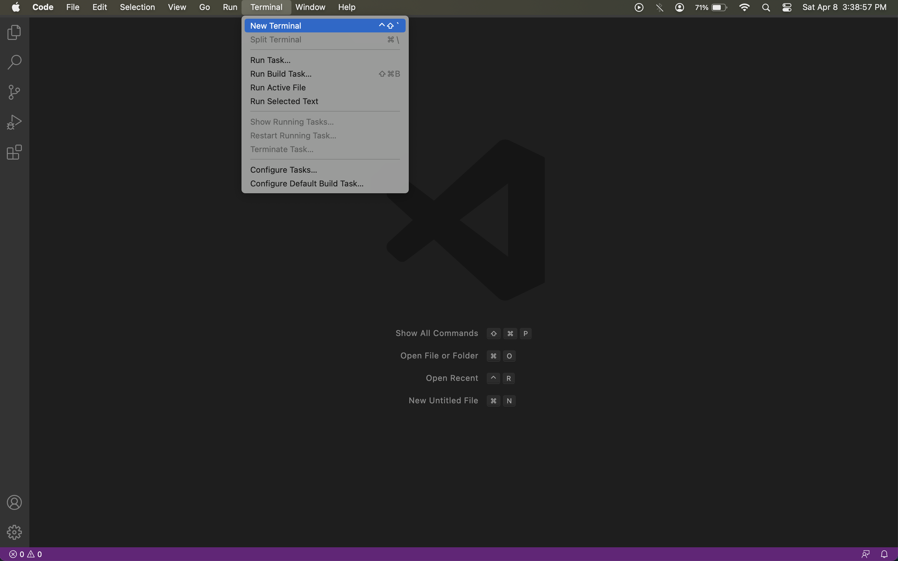
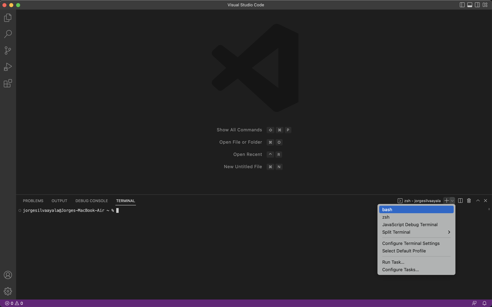
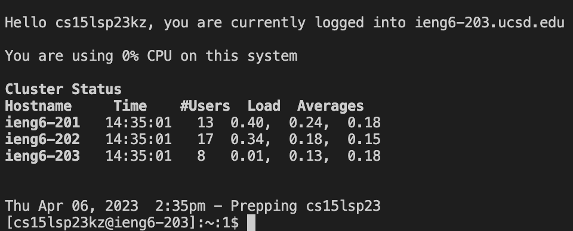
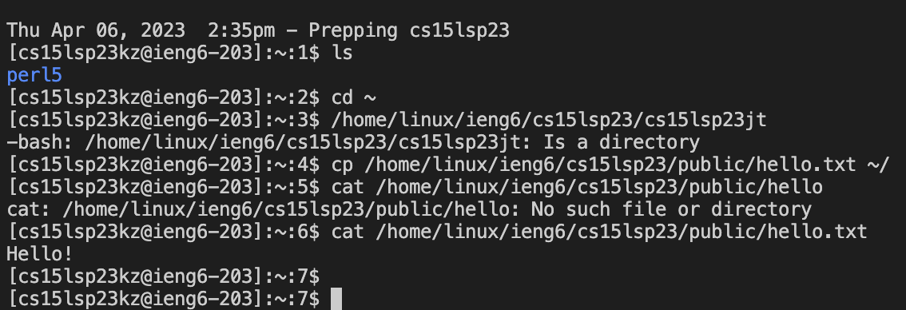

# CSE 15L Remote Access

## CSE15L Account 
The first step is to look up your course-specific account. Use this link to find it:
[https://sdacs.ucsd.edu/~icc/index.php](https://sdacs.ucsd.edu/~icc/index.php)

You will have to reset your password - this link will show you step by step on how to do this: [Step by Step Tutorial](https://drive.google.com/file/d/17IDZn8Qq7Q0RkYMxdiIR0o6HJ3B5YqSW/view)

## Installing VS Code
The second step is installing [VS Code](https://code.visualstudio.com/)
Follow the instructions on the website carefully.
There are diffrent versions for diffrent operating systems so be sure to choose the correct one.
(Note: If you prefrer to do it on the computers in the lab you can open VS Code on any of the computers.)

You should be able to open a window that looks like this:


(It may look diffrent depending on the system settings)

## Connecting Remotely 

The first step is intalling git for Windows. If you are on macOS you do not need to download anything.

[Git for Windows](https://gitforwindows.org/)

Windows
---

Once you have installed git follow the steps in the following link to use the newly installed git bash in VS Code.
[Using Bash for Windows](https://stackoverflow.com/questions/42606837/how-do-i-use-bash-on-windows-from-the-visual-studio-code-integrated-terminal/50527994#50527994)

Mac
---
When using macOS you will be able to open it directly on VS Code without having to intall anything.

The first step willl be to open a new terminal. To do this go to "Terminal" and click the "New Terminal button".


The next step is to switch from zsh to bash. We do this by clicking the drop down menu next to the plus button and selecting "bash".


Logging in
---

Once you have set up the terminal, run the following code (Your command will be the same except for the "zz" which will be replaced by the letteres in your course specific account).

`$ ssh cs15lsp23zz@ieng6.ucsd.edu`

(Note: Do not type in the "$" when running the command. It is there to represent what you should type after it)

Since this the the first time that you will be connecting to this server the following message will pop-up:
```
The authenticity of host 'ieng6.ucsd.edu (128.54.70.227)' can't be established.
RSA key fingerprint is SHA256:ksruYwhnYH+sySHnHAtLUHngrPEyZTDl/1x99wUQcec.
Are you sure you want to continue connecting (yes/no/[fingerprint])? 
```
It is usual to get this message whne connceting to a server for the first time. I (Jorge) always say yes. If you get this message wehn connecting to a sever you connect to often it could mean someone is trying to control the connection or trying to listen in on your connection.

More details about this message can be found here: [Terminal Message](https://superuser.com/questions/421074/ssh-the-authenticity-of-host-host-cant-be-established/421084#421084)

Type yes and then enter the password you made whne you were asked to reset. (Note: No text or symbols will appear when you are typing your password. If you misinput your password a new line will appear where you will have to enter your password once again.)


Once you have logged in you should see something similar to the image below in yout terminal.


Now your computer is connected to a computer in the CSE basement.

## Running Commands
Now that you are logged in try running some commands in the termnal to see if they work. Here are a few examples I ran on mine.


