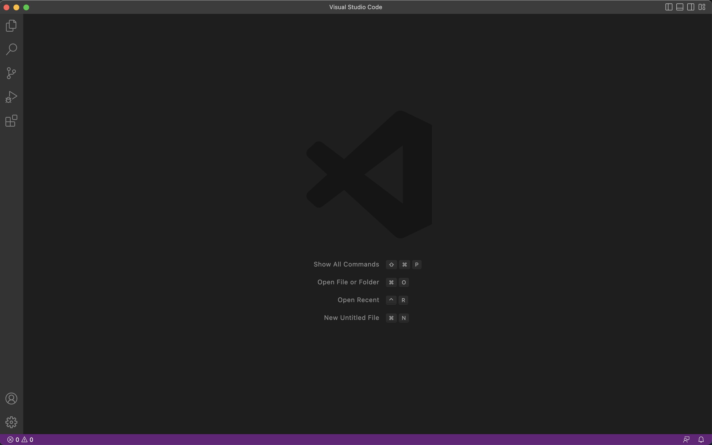

# CSE 15L Remote Access

## CSE15L Account 
The first step is to look up your course-specific account. Use this link to find it:
[https://sdacs.ucsd.edu/~icc/index.php](https://sdacs.ucsd.edu/~icc/index.php)

You will have to reset your password - this link will show you step by step on how to do this: [Step by Step Tutorial](https://drive.google.com/file/d/17IDZn8Qq7Q0RkYMxdiIR0o6HJ3B5YqSW/view)

## Installing VS Code
The second step is installing [VS Code](https://code.visualstudio.com/)
Follow the instructions on the website carefully.
There are diffrent versions for diffrent operating systems so be sure to choose the correct one.
(Note: If you prefrer to do it on the computers in the lab you can open VS Code on any of the computers.)

You should be able to open a window that looks like this:

(It may look diffrent depending on the system settings)

## Connecting Remotely 

The first step is intalling git for Windows. If you are on macOS you do not need to download anything.

[Git for Windows](https://gitforwindows.org/)

Windows
---
Once you have installed git follow the steps in the following link to use the newly installed git bash in VS Code.
[Using Bash for Windows](https://stackoverflow.com/questions/42606837/how-do-i-use-bash-on-windows-from-the-visual-studio-code-integrated-terminal/50527994#50527994)

Logging in
---

Once you have set up the terminal, run the following code (Your command will be the same except for the "zz" which will be replaced by the letteres in your course specific account).

`$ ssh cs15lsp23zz@ieng6.ucsd.edu`

(Note: Do not type in the "$" when running the command. It is there to represent what you should type after it)

