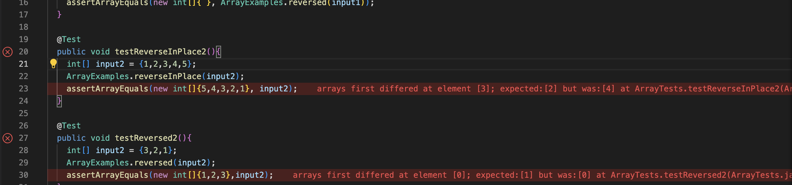

# Lab Report 2
## Part 1


The methods that are being callled are the get query method,split method and the get path method.

The values specific to this is the message variable which gets added anything after the query and then prints it to the screen.


The values specific to this is the message variable which gets added anything after the query and then prints it to the screen.

## Part 2
The following block of code should return a new array with all of the elements in the input array in reversed order.
```
  static int[] reversed(int[] arr) {
    int[] newArray = new int[arr.length];
    for(int i = 0; i < arr.length; i += 1) {
      arr[i] = newArray[arr.length - i - 1];
    }
    return arr;
  }
```
Insted of revesing the order the array would be full of zeros.


To fix this code I switched which array was being copied and returned the new array that was produced.
Here is the function code:
```
  static int[] reversed(int[] arr) {
    int[] newArray = new int[arr.length];
    for(int i = 0; i < arr.length; i += 1) {
      newArray[i] = arr[arr.length - i - 1];
    }
    return newArray;
  }
  ```
## Part 3
In week 3 I learned how to notice symptoms from a code. I learned to read the symptoms to find the code that was failing. I also learned how to use JUNIT tests in order to test my code.


This image shows the message that shows the error I recieved which help me find what exactly was failing in my code.


This image shows how I implemented JUNIT tests to see if my code ran correctly without any bugs.
