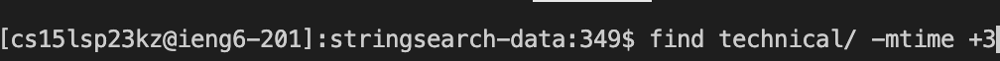
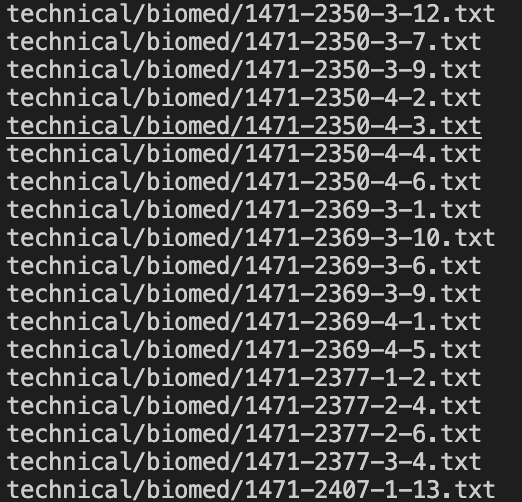
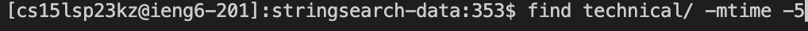
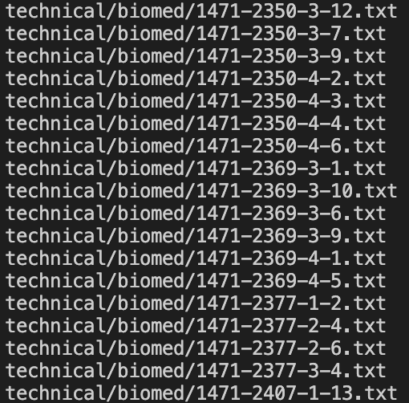
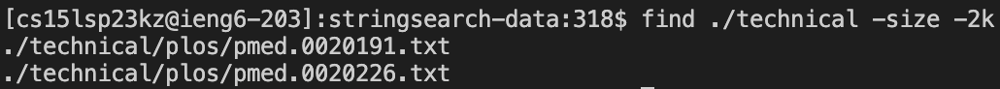
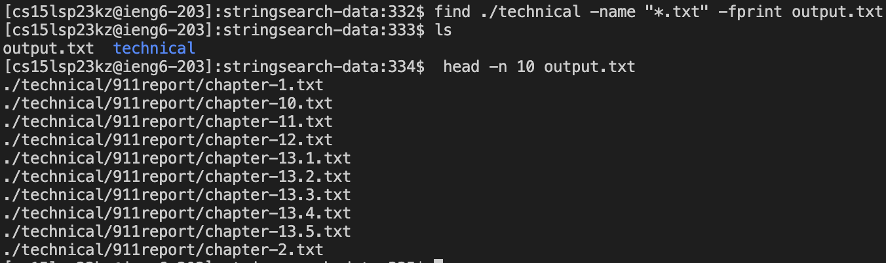
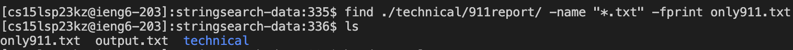
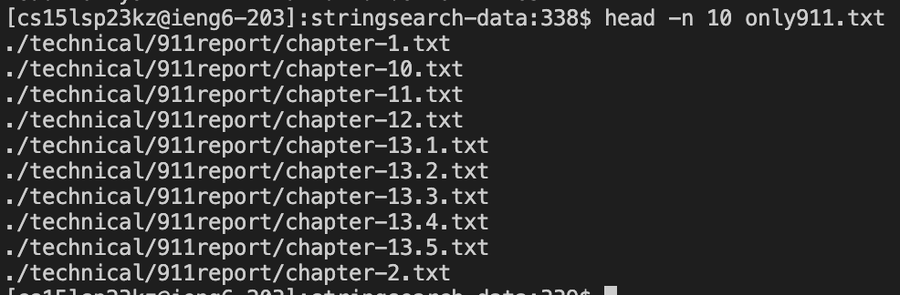

# Lab Report 3
For this Lab Report I chose the `find` command. 
## Last Modified
The first option is `-mtime`. The syntax for this is:

`$find [path] -mtime +[whole number]` or `$find [path] -mtime -[whole number]`

The command finds files based on their modification time.

In the images above we see the command being used with the plus indicator. The plus indicator means more than. It found all the files in the technical directory and returns all the files that were modified more than 3 days ago

In the two images above we see the command being used with the minus indicator. This command found all the files in that directory that were modified less than 5 days ago.

This command could be useful to find any files that you edited recently to see what you've worked on.

## File Size
The following command is `-size`. The syntax for the command is:
`$find [path] -size +[size]` or `$find [path] -size -[size]`

This command finds all the files that or greater or less than the specified size.

In the image above we see the plus sign being used. This gives us all the files within directory that are greater than 200 kibibytes,

In the image above we see the minus sign being used. This printed out all the files in the directory that are less than 2 kibibytes.

Note: the size can be "c" - for bytes, "w"- for two-byte words, "k" - for kibibytes, "M" - for mebibytes, "G" - for gibibytes.

This command could be useful as it shows you what files are the biggest to see what is taking up the most space.

## File Type
The next command is the `-type` command. The syntax for this command is:
`find [path] -type [type or mode]`

The command searches for the specific type of files specified in the directory specified.

In the image above we see the use of the command to find all directories in the technical directory.

In the two images above we see the command being used to find regular files in the technical directory.

Note: We can use "b" - block (buffered) special, "c" - character (unbuffered) special, "d" - directory, "p" - named pipe (FIFO), "f" - regular file.

This command is useful because you can use it to filter out any unwanted types.

## Print
The final command is `fprint`. The syntax for this commad is:
`$find [path] -type [filetype] -fprint [filename]`

The command writes the results of a search into a file. If the file does not already exist it creates one in your current directory.

In the image above we search for all files that end in ".txt" and save it to a file called "output.txt". We can see the file was created in the current directory. We print use `cat` to see that the results were saved in that file.

In the two images above we find all the files in a path that end with ".txt" and save them to another file.

This command is useful because you can save searches in a file for future references.

# Sources
[man7.org](https://man7.org/linux/man-pages/man1/find.1.html)
