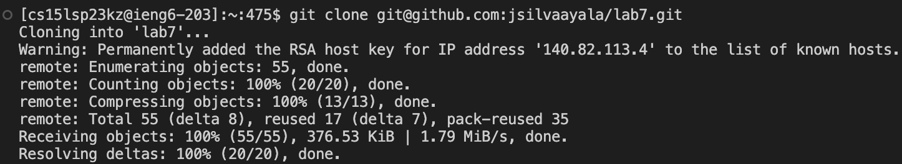
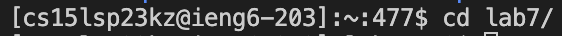
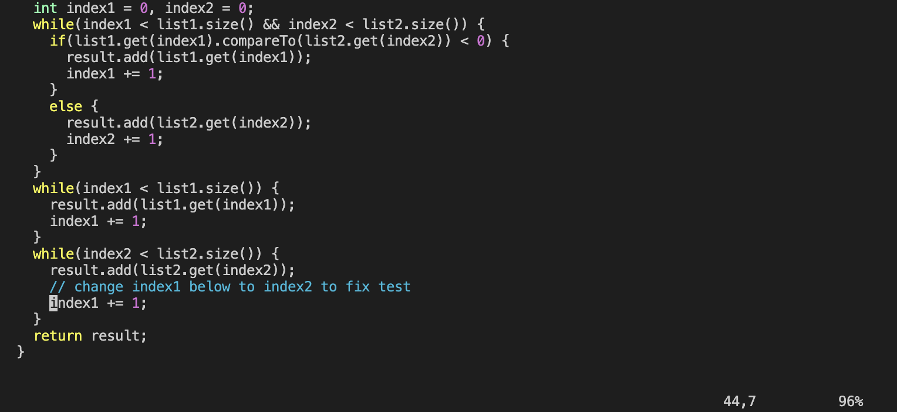
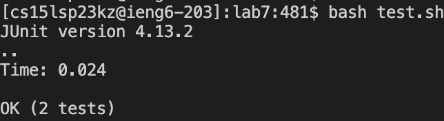

# Lab Report 4

## Step 1 - Log into ieng6

Keys pressed: `<Ctrl-r> ssh <enter>`

The `<Ctrl-r>` searches your command history. We type the first letters of a command; it shows all commands that start with those same letters. 
This saves time by not requiring you to type your entire username when logging in.

## Step 2 - Clone your fork of the repository from your Github account

Keys pressed: `git <space> clone <Cmd-v> <enter>`

To clone the repository onto the remote account, we copy the SSH link from Github and use the `git clone` command to create a copy of the repository.

## Step 3 - Run the tests, demonstrating that they fail

Keys pressed: `ls <enter>`

To begin, we check our files and directories in our current directory with the `ls` command.

Keys pressed: `cd <space> l <tab> <enter>`

Next change into the "lab7" directory using the `cd` command. By pressing `<tab>` it autocompletes the directory name of "lab7" since there is only one directory that starts with the letter L.

Keys pressed: `bash<space> t <tab> <enter>`

To check if the test, passed we run the test.sh file. To do this we use `bash` followed by the file name. We once again use the `<tab>` feature to autocomplete the file name.

## Step 4 - Edit the code file to fix the failing test

Keys pressed: `vim Li<tab> <space> .j <tab> <enter>`

To edit the file, we use the text editor Vim. To do this we type `vim` followed by the file we want to edit. We use the `<tab>` key twice. The first time it auto completes the first portion of the file name.
We must type `j` and then press `<tab>` to get the java file since there is a .java file and a .class file.

Keys pressed: `/index1<enter>`

Search for index1 using the search feature in Vim. To do this simply type `/` followed by the word you want to search. This must be done in Normal mode.

Keys pressed: `n * 9`

To see all the results found we press the `n` key. In this case must press the `n` key 9 times to find the error in the file.

Keys pressed: `1w`

The command `1w` allows us to move the cursor 1 word. This eliminates the repeated pressing of the arrow keys. You can change the number to move the cursor forward by a different number of words.

Keys pressed: `<left arrow>`

This moves the cursor 1 spot to the left.

Keys pressed: `i`

Pressing `i` takes us into insert mode. In insert mode we can type and insert text into the file.

Keys pressed: `<backspace> 2`

We edit the mistake that was in the file.

Keys pressed: `<esc>`

Pressing `<esc>` exits insert mode and returns to normal mode.

Keys pressed: `:wq<enter>`

Once in normal mode we can save the changes we made and exit vim with this command.

## Step 5 - Run the tests, demonstrating that they now succeed

Keys pressed: `<Ctrl-r> ba<enter>`

To run the tests, we use the `Ctrl-r` command again to search for the previously executed bash command.

Verify that all test passed.

## Step 6 - Commit and push the resulting change to your Github account (you can pick any commit message!)

Keys pressed: `git <space> add <space> Li<tab> <space> . <tab> <enter>`
Keys pressed: `git status  <enter>`

We use the ` git add` command to select the file we want to include in the next commit. The `<tab>` key is used twice here to autocomplete the file name.
Then, we use the `git status` command to see all files that are ready to be committed and check if the file we added is there.

Keys pressed: `git <space> commit <space> -m “Fixed bug” <enter>`

The `git commit -m` command allows us to commit the changes with a message. The message is put between quotation marks.

Keys pressed: `git <space> push <space> origin <space> main <enter`

Finally, we use the `git push` command to upload commits to a remote repository.
