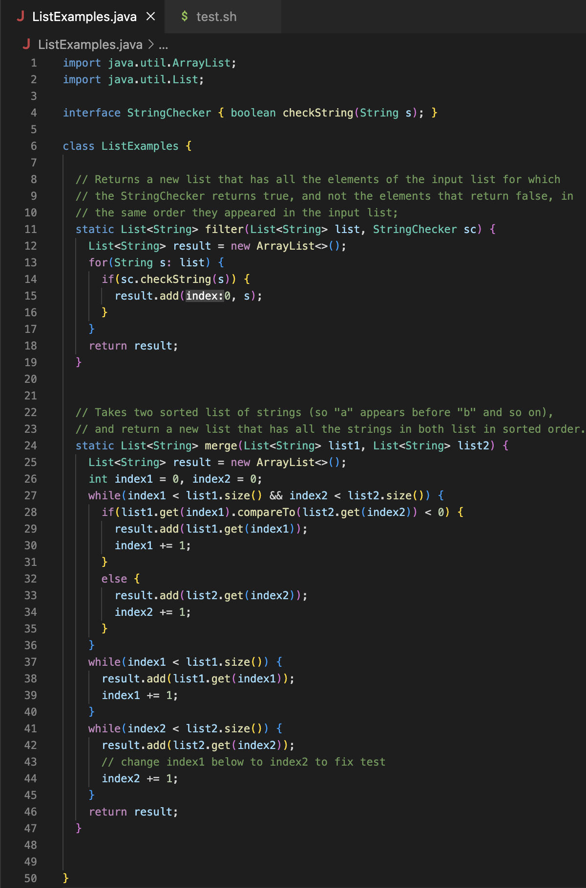

# Lab Report 5

## Part 1

### Student Question

### Reply from TA

TA: Hey Student when we look at the output, we can find more information than just the type of exception thrown. Try looking past that line and seeing if it gives you more details. Maybe try looking at all the other files that are in play when running your command.

### Student Output

The bug was in the test.sh file. On the second line instead of "ListExamplesTests" it was using "ListExamplesTests.java".

### Information

1) It was the lab 7 repository and I was working in the ListExamples.java and test.sh files.

2) 
   
   
3) `bash test.sh`

4) To fix the bug we must go to the test.sh file and change ListExamplesTests.java to ListExamplesTests in line 2.

## Part 2

### Reflection

One new thing I learned in the second half of the quarter is how to edit files in a remote account using vim. Throughout the quarter, I wondered if we always had to clone repositories in order to edit files on remote accounts but using vim we can edit files from the terminal. It is useful because we can do quick changes this way to test our code.
